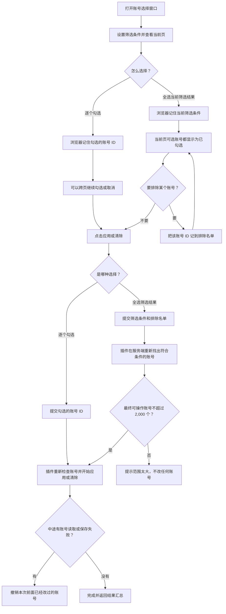

# StickyProxy：账号选择窗口和大量账号全选方案

> **状态：V2 已实现并部署；V3 独立应用代理模型待实现。**
>
> 本文记录账号选择窗口、分页和大规模全选的实现方案与使用规则。V3 将删除当前代理语义，使每条代理可独立应用给不同账号。

## 1. 现在有什么问题

从某条代理点击“应用代理”“按代理清除”，或点击“清除账号代理”后，会打开同一个账号选择窗口。现在主要有三件事不舒服：

1. **窗口不够像主操作窗口。**
   账号多的时候，筛选条件、全选/全不选、翻页和确认按钮会跟着账号列表一起往下滚。想翻页或点确认，经常要再滚回去。

2. **翻一页也可能很慢。**
   现在即使只看一页 50 个账号，插件也会把很多账号的配置读出来，检查它们各自有没有账号代理。账号达到几千或上万时，这样翻页不划算。

3. **“全选当前筛选结果”不适合很多账号。**
   现在的做法是：
   - 后端找出所有符合筛选条件的账号 ID；
   - 把这一长串 ID 发给浏览器；
   - 用户点同步后，浏览器再把同一长串 ID 发回后端。

   这里**不会把邮箱发来发去**，但成千上万个账号 ID 一样会让响应、请求和浏览器内存变大。

现在还有一个安全限制：一次最多操作 2,000 个账号。超过后不会真的写入上万个账号，但前面的“找全部 ID、传全部 ID”依然不够省。

## 2. 这次要达到什么效果

- 账号选择窗口盖住 StickyProxy 当前页面的主要内容。
- 标题、筛选条件、全选/全不选、翻页、取消和确认按钮一直固定在窗口里。
- **只有账号列表本身可以滚动。**
- 正常翻页时，只读取当前页账号需要的信息，不把所有账号的详细配置都读一遍。
- 点“全选当前筛选结果”时，浏览器不再接收全部账号 ID。
- 应用和清除的安全规则不变：只处理你选中的账号；出错会回滚已修改的账号；一次最多 2,000 个最终能写入的账号。

这次**不做**下面这些事：

- 不修改 CLIProxyAPI 的全局代理。
- 不自动把所有账号都套上代理。
- 不保存浏览器侧的账号选择集；成功应用后仅持久化 `auth_index -> proxy_id` 的账号代理映射。
- 不把最终代理地址、代理密码、账号代理映射以外的认证文件内容交给浏览器。
- 不因为账号很多就偷偷只处理前 2,000 个；超过上限必须明确报错，让操作者缩小筛选范围。

## 3. 账号选择窗口长什么样

打开账号选择窗口后，内部区域固定成下面这样：

```text
┌────────────────────────────────────────────────────────────────┐
│ 应用代理 / 按代理清除 / 清除账号代理                       [×]  │ 固定
├────────────────────────────────────────────────────────────────┤
│ 说明：这次会操作哪些账号                                      │ 固定
│ 搜索、Provider、类型、状态、代理状态、优先级、备注等筛选条件   │ 固定
│ [全选当前筛选结果] [全不选]              当前选择状态          │ 固定
├────────────────────────────────────────────────────────────────┤
│                                                                │
│                      当前页账号列表                             │ 这里滚动
│                                                                │
├────────────────────────────────────────────────────────────────┤
│ [上一页]                  第 N 页                  [下一页]    │ 固定
├────────────────────────────────────────────────────────────────┤
│ 当前选择状态                       [取消] [同步 / 清除]        │ 固定
└────────────────────────────────────────────────────────────────┘
```

具体规则：

- 大屏时窗口尽量铺满 StickyProxy 页面可用区域；小屏时直接全屏。
- 背景页面不能点，也不能跟着滚。
- 点关闭按钮、按 Escape、点击遮罩都可以关闭窗口；正在同步或清除时不允许误关。
- 换页或改筛选条件后，账号列表自动回到最上面。
- 搜索输入仍保留短暂防抖，避免每敲一个字就请求一次。
- 只要改了任一筛选条件，当前勾选会清空。这样不会出现“页面看的是新筛选，但实际还带着旧筛选全选结果”的误操作。

### 关于“覆盖主窗口”

插件可以可靠地覆盖它自己所在页面的完整可视区域。

如果 CPA 是把插件页面直接打开为一个页面，这就是覆盖主窗口。如果 CPA 是把插件塞进一个 iframe，插件只能覆盖该 iframe，不能靠插件 CSS 去盖住 iframe 外面的 CPA 页面。这是浏览器的隔离规则，不是样式层级不够高。

实施时会先按当前 CPA 的真实打开方式验证：能覆盖完整插件页就按这个方案交付；如果你要求盖住 iframe 外层的 CPA 页面，需要 CPA 宿主额外支持，不应靠插件硬绕过。

## 4. 账号分页怎么变快

CPA 给插件的账号信息有两层：

- 一层是账号的基础资料：邮箱、Provider、类型、状态、优先级、备注等；
- 另一层是单个账号的详细配置，里面才有该账号的 `proxy_url`。

普通翻页时，不需要为了看第 1 页就把所有账号的详细配置都打开。新的做法是：

1. 先拿到全部账号的基础资料；
2. 按搜索词、Provider、类型、状态、优先级、备注等条件筛选和排序；
3. 找到当前要展示的一页，例如 50 个账号；
4. **只读取这 50 个账号**的详细配置，显示它们的代理状态、脱敏地址和是否可选。

所以如果有 10,000 个账号，正常查看第 N 页时，大约只需要再读 50 份详细账号配置，不再每次都读 10,000 份。

### 代理状态筛选是个例外

“已应用 StickyProxy 代理 / 继承系统代理 / 其他账号代理”这类筛选，要看账号详细配置里的 `proxy_url`，并与所有保存代理逐一比较后才能判断。

因此用户一旦筛选“代理状态”，插件不得不多读一些账号详细配置。这种情况下会这样处理：

- 仍然一页一页找；找到当前页需要的数量就先返回；
- 不为了显示一个精确的“共 X 个账号”而把全部账号都扫一遍；
- 页面只显示“第 N 页”和是否还能继续下一页；
- 真正点“全选当前筛选结果”时，才会完整检查所有符合条件的账号，并在发现第 2,001 个可操作账号时立即停止。

换句话说：普通看列表快；只有你明确用了“代理状态”这种较重的筛选，插件才多做一些检查，而且不会为了显示总数白白扫完整库。

## 5. “全选当前筛选结果”以后怎么做

### 一句话版本

不再把全部账号 ID 先发给浏览器，再由浏览器传回来。

浏览器只告诉插件两件事：

1. 你点全选时用了哪些筛选条件；
2. 全选以后你又手动取消了哪些账号。

等你点“同步”或“清除”时，插件在服务端自己重新找出应操作的账号，检查数量和合法性，然后执行。

### 两种选择方式

| 你怎么选 | 浏览器记住什么 | 适合什么情况 |
| --- | --- | --- |
| 一个个勾选 | 勾选的账号内部 ID | 少量账号、跨页手动挑选 |
| 点“全选当前筛选结果” | 当时的筛选条件 + 后来取消勾选的少量账号 ID | 一个筛选结果里的大批账号 |

这里的“账号内部 ID”只是 CPA 用来指向账号的标识，不是邮箱，也不包含代理地址或账号密钥。

### 5.1 全选流程图



### 5.2 用户实际会看到什么

- 手动勾选时：显示“已选 12 / 356”。
- 点全选后：显示“已选当前筛选结果（服务端处理）”。
- 全选后，当前页可选账号默认都是勾选状态。
- 取消某个账号，它会被加入排除名单；以后翻回这页，该账号仍会显示为未勾选。
- 再次勾选它，就从排除名单移除。
- 改筛选条件、点全不选、同步/清除成功、关闭窗口，都会清空本次选择。

### 5.3 点击确认后，插件会做什么

插件会在同一段操作里完成下面这些事：

1. 确认本次发起操作的代理仍存在；代理被编辑或删除后，提示重新打开窗口。
2. 按你点全选时的筛选条件，重新找符合条件的账号。
3. 去掉你后来手动排除的账号。
4. 再次确认每个账号还存在、有可用邮箱、配置文件能读、文件名安全。
5. 如果最终可操作账号超过 2,000 个，马上停止，**不修改任何账号**。
6. 数量在上限内才逐个应用本次代理，或逐个清空账号代理。
7. 任意一步保存失败，就把这次已经改过的账号恢复到操作前。

浏览器不会拿到最终代理地址、代理密码、账号配置原文，也不会收到完整的全选账号列表。

### 5.4 “全选”到底选的是哪些账号

全选不是把当时看到的账号 ID 列表永久冻住，而是下面这个意思：

> 你点确认的那一刻，仍然符合“你点全选时保存的筛选条件”、并且不在你手动排除名单里的可操作账号。

这样做的好处是：不用在浏览器里塞几千上万个 ID，也不会拿着很久以前的旧账号列表去操作。

代价是：如果你点全选后，CPA 里刚好新导入、删除或修改了账号，点确认时的目标账号可能会和刚点全选时略有不同。这是当前 CPA 没有提供“账号列表固定版本”能力时，最安全、最省资源的折中。

## 6. 2,000 个账号上限

建议继续保留“每次最多 2,000 个最终可操作账号”的限制。

原因很简单：同步账号代理不是只改内存，而是要逐个修改 CPA 账号配置；任何一个后面失败，都可能需要把前面已修改的账号全部回滚。一次操作数太大，会让操作时间、失败风险和回滚成本一起变高。

规则是：

- 2,000 个及以下：允许执行。
- 2,001 个或更多：直接提示“筛选范围太大，请继续缩小条件”。
- 超过上限时：**一个账号也不改**。
- 不自动拆成多批，不偷偷只处理前 2,000 个。

如果你以后确实需要批量处理更多账号，可以按 Provider、优先级、备注或其他筛选条件分批执行。每一批都有清楚的结果和独立的回滚保障。

## 7. 安全规则不变

下面这些现有规则保持不变：

- 插件只改账号级 `proxy_url`，不改 CPA 全局代理。
- 只改你明确选中的账号，或你明确全选的筛选结果。
- 同步前重新检查账号是否还能操作，不能因为列表里曾经显示可选就直接写。
- 最终代理地址只在插件和 CPA 之间使用，页面只看脱敏内容。
- 如果同步中途失败，撤销这一轮前面已经成功的修改。
- “按代理清除”只清理本次明确选择的代理、且确实使用该代理的账号；手工设置的其他代理和其他 StickyProxy 代理不动。

## 8. 做完后怎么验证

### 页面验证

- 打开账号选择窗口后，窗口覆盖完整 StickyProxy 页面；背景不能点、不能滚。
- 滚动几百个账号时，筛选、全选/全不选、翻页和确认按钮都不动。
- 普通筛选翻页时，账号多也不会因为每页读取全部账号详细配置而明显变慢。
- 点全选后，不会再看到“先把全部账号 ID 下载到浏览器”的请求。
- 全选后跨页、取消勾选、重新勾选都显示正确。
- 改筛选条件会清空选择。
- 不同账号应用不同代理、同一账号重新应用另一代理、按代理清除不误清其他代理都要验证。
- 2,000 个、2,001 个、账号不存在、账号无邮箱、账号配置不可读、保存失败和回滚都要验证。

### 上线验证

审核通过后才做：

1. 在本地跑前端检查、前端测试、Go 测试并构建插件。
2. 远端先备份旧的 `stickyproxy.so`。
3. 上传新文件，校验文件完整后替换。
4. **只重启 CPA 的 `cpa` 服务**，不重启管理面板服务。
5. 看日志确认新插件加载成功，刷新插件页面做人手验证。
6. 如果加载或功能不对，恢复备份文件，再次只重启 `cpa`。

重启 `cpa` 会有短暂中断，需要你确认合适的时间再执行。

## 9. 请你确认的点

V3 独立应用代理模型需要确认：

1. 每条代理可独立应用给任意账号；同一账号重新应用另一代理时只覆盖该账号，这一规则是否确认？
2. 一次最多 2,000 个最终可操作账号，是否继续保留？我建议保留。
3. 全选的含义是否接受为：**点击确认时，重新找出仍符合当时筛选条件的账号**？我建议接受。
4. 用“代理状态”筛选时，是否接受不显示精确总数，只能一页一页继续看？这样能避免一次把所有账号配置读完。
5. 如果插件页面被 CPA 放在 iframe 中，是否接受先覆盖插件自己的完整区域？如果一定要盖住 CPA iframe 外层页面，需要 CPA 宿主另外支持。
6. 是否允许进入实现、测试、备份替换远端插件并重启 `cpa`？
